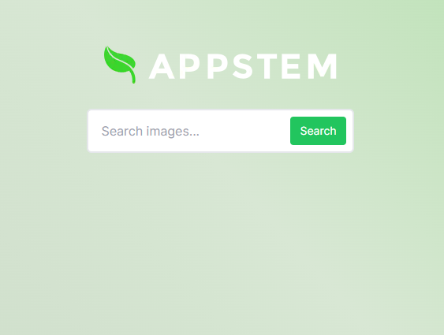

# Appstem Full Stack Web Developer Prototype

This is my attempt at the Appstem Full Stack Web Developer Prototype.

The app displays a text input with a button that is used to search the Pixabay Image API. When the user scrolls, the app will load the next page of images from the Pixabay API in an "endless scroll" way. When clicking on an image, the image will be displayed in an overlay/modal with some additional information. If the API reaches the end of the images for the current query, a small toast/notification will display denoting the end of the images.




## Assumptions & Decisions

#### Architecture / Design / Libraries

- For this project I decided to use Next.JS, as Next.JS makes it easy to quickly build and deploy fullstack applications.
- Some helpful libraries I used include:
  - `lodash`
  - `headlessui`
  - `react-toastify`
  - `tailwindcss`

#### Frontend / Endless Scroll Effect

- To achieve the endless scroll effect I am assuming that after a user enters a search query, once they scroll close enough to the bottom of the page the middleware/API will be called to retrieve the next page of images.
- For implementation, I am utilizing a scroll event listener that keeps track of helpful scroll-related values and will fetch the next page of image results when the bottom of the page is detected.

#### Middleware / API

- An assumption I made in terms of the middleware was that it should be a layer of code that sits between the client and the 3rd party Image API, and that runs in Node/on the server, but that it didn't necessarily have to be specifically "Express/Next.JS middleware".
- My implementation of the middleware is built using a Next.JS API route which the client can call to retrieve formatted data from the Image API for consumption on the frontend.

#### Deployment

- I decided to deploy the project using Vercel, because of its ease of use and familiarity I have with Vercel.

#### Continued / Future Development

- If I were to continue working on the project and extend upon it I would explore the follow features/ideas:
  - leverage unused parts of the Image API to add features like:
    - using `order` to add a sorting feature
    - using `category` and `colors` to implement a filtering feature
  - add an `X` button that can clear the current search query

---

## Running Locally

```
yarn run dev
```

**NOTE:** make sure to set a local env variable for `PIXABAY_API_KEY` in `.env.local` in order to be able to interact with the API. See the [Pixabay API Docs](https://pixabay.com/api/docs/) for more information.

---

## API Documentation

```
GET /api/images
```

### Query Params

| Param       | Type   | Description                                                    | Required? |
| ----------- | ------ | -------------------------------------------------------------- | --------- |
| page        | number | The current page to fetch for the current search query         | ✅        |
| perPage     | number | The number of results to return for each page (defaults to 10) |           |
| searchQuery | string | The query used to search for images                            | ✅        |

#### Example request

```
http://localhost:3000/api/images?searchQuery=apple&perPage=10&page=1
```

### Returns

#### Example return object

```js
{
    "query": "apple",
    "currentPage": 1,
    "previousPage": null,
    "nextPage": 2,
    "perPage": 10,
    "totalResults": 500,
    "totalPages": 50,
    "images": [
        {
            "id": 1122537,
            "pageURL": "https://pixabay.com/photos/apple-water-droplets-fruit-moist-1122537/",
            "type": "photo",
            ...
        },
        ...
        {
            "id": 2788651,
            "pageURL": "https://pixabay.com/photos/apples-apple-tree-fruits-orchard-2788651/",
            "type": "photo",
            ...
        }
    ],
    "updatedAt": 1697396739677
}
```

### References

- [Difference between Debouncing and Throttling](https://www.geeksforgeeks.org/difference-between-debouncing-and-throttling/#)

## To-Do

### Frontend

- ~~add form for searching images~~
- ~~add gallery of images~~
- ~~add responsive overlay~~
- ~~display data served from the API~~
- ~~implement "endless scroll effect"~~
- ~~improve design and styles~~
- ~~make sure design is responsive and looks good/works well on multiple devices~~
- ~~add helpful UX items~~

### API

- ~~select an image search API to use~~
- ~~create account and retrieve API key from image search API~~
- ~~fetch data from the API~~
- ~~store API key in an env variable~~
- ~~create a middleware layer to help with frontend consumption~~
  - ~~paginated~~

### Testing / Error Handling

- ~~implement error handling~~
  - ~~add error handling during API calls~~
  - ~~display errors in UI/UX~~
- add some unit tests (?)

### Deployment / Deliverables

- ~~host project on vercel~~
- ~~make github repo public~~
- ~~set up env variables~~
- send deployed project link and github repo link to Robert by end of day Sunday

### Misc

- ~~use TypeScript~~
- ~~add necessary typings~~
- ~~add pre-commit hook to run pretty-quick and eslint~~
- ~~update readme with assumptions and decisions~~
- ~~add as much documentation as possible (Types, JSDoc, etc)~~
- ~~add .prettierrc~~
- ~~use appstem logo~~

### Stretch Goals

- ~~add loading animation when loading next page~~
- ~~add toast denoting end of pages~~
- add debug mode
- ~~add "Displaying ## images out of ##"~~
